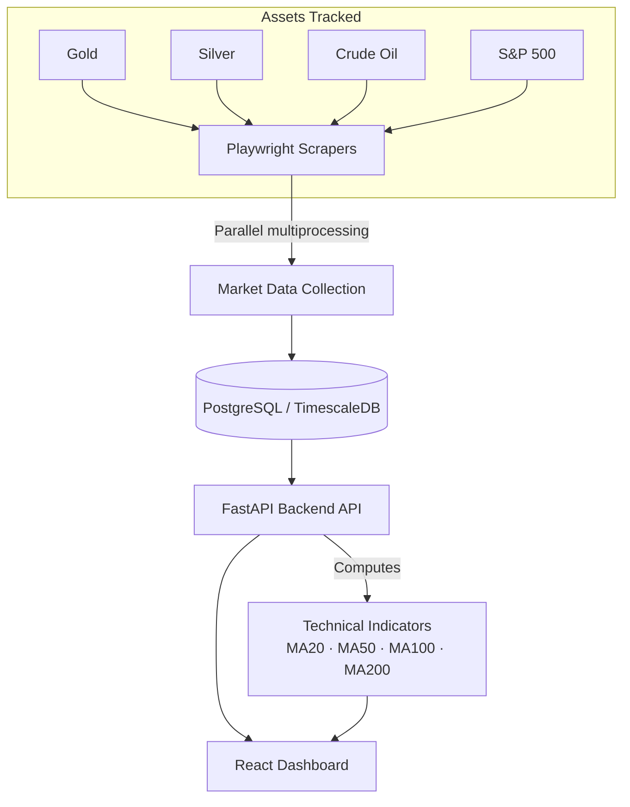
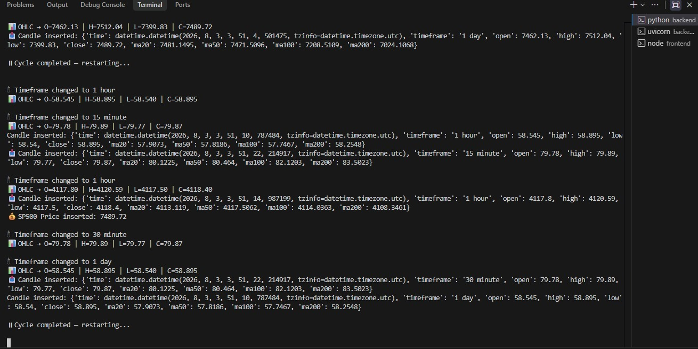
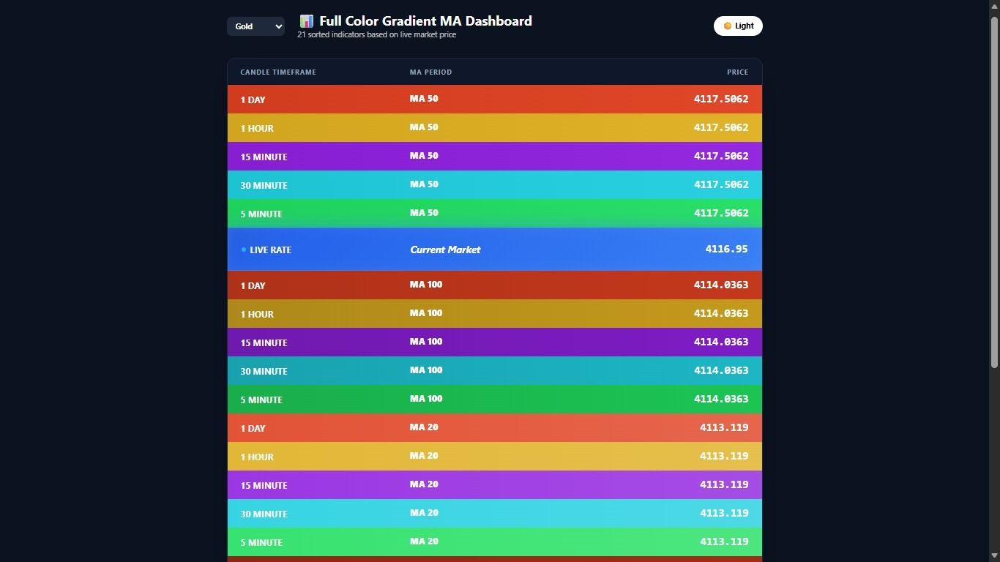
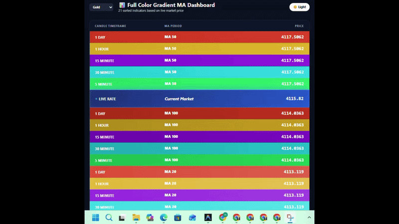
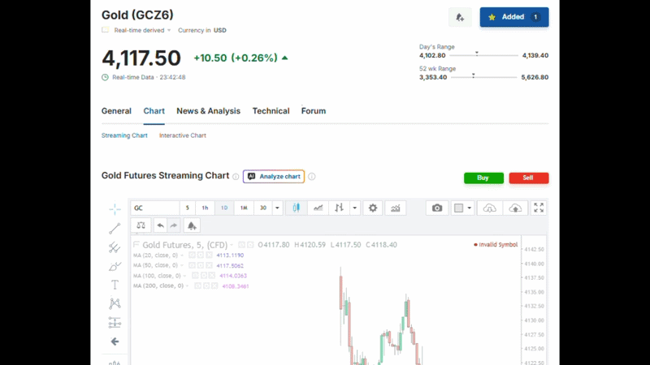
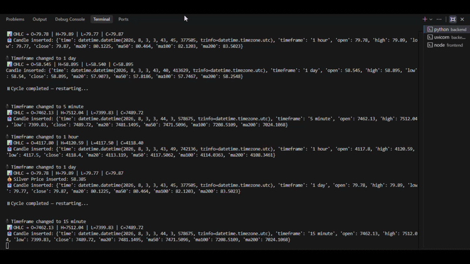

<h1 align="center">🤖 Autonomous AI Trading Agent</h1>

<p align="center">
  <b>An autonomous, real-time market intelligence system that eliminates manual monitoring —</b><br/>
  collecting live multi-asset market data, computing technical indicators, and visualizing insights the moment they happen.
</p>

<p align="center">
  
  
  
  
  
  
  
  
</p>

---

## 🎯 Overview

Manually tracking multiple markets — checking prices, recalculating moving averages, watching for trend shifts — doesn't scale, and it's easy to miss a signal the moment it matters. This system removes that bottleneck entirely.

It runs **parallel browser-automation pipelines** that continuously pull live data across four asset classes, feeds it into a **high-frequency time-series database**, and serves it through a **FastAPI backend** to a **live-updating React dashboard** — so market state, moving averages, and trend signals are always current, with zero manual checking required.

Built for resilience, not just demonstration: the scraping layer auto-restarts on crashes, and the multiprocessing architecture is designed to run unattended for extended periods.

---

## ✨ Features

- **Real-time monitoring across 4 asset classes** — Gold, Silver, Crude Oil, and S&P 500 — tracked simultaneously, not sequentially
- **Zero-touch data collection** via Playwright-driven browser automation, replacing what would otherwise be manual price-checking
- **High-frequency time-series storage** in PostgreSQL with TimescaleDB hypertables, built to handle continuous market data ingestion without degrading query performance
- **Parallel, fault-tolerant architecture** — multiprocessing with auto-restart crash handling, so the system keeps running unattended
- **Automated technical indicators** calculated continuously: MA20, MA50, MA100, MA200
- **Live interactive dashboard** built with React — no manual refresh needed to see current market state

---

## 🛠️ Tech Stack

| Layer | Technologies |
|---|---|
| **Data Collection** | Playwright, Multiprocessing |
| **Backend / API** | Python, FastAPI |
| **Database** | PostgreSQL, TimescaleDB |
| **Frontend** | React, TailwindCSS, Vite |

---

## 🏗️ System Architecture



---

## 📸 Dashboard Preview

The dashboard displays:
- Live market prices across all 4 tracked assets
- Real-time moving averages (MA20/50/100/200)
- Technical indicator overlays
- Market trend visualization

### Static Previews
<p align="center">
  
  &nbsp;&nbsp;
  
</p>

<p align="center">
  <i>
    Left: Real-time terminal output showing live market data collection and processing.<br/>
    Right: Interactive AI Autonomous Trading Agent dashboard displaying market insights and analytics.
  </i>
</p>

### Live Operations

**Dashboard in Action**
<p align="center">
  
</p>

**Automated Browser Scraping**
<p align="center">
  
</p>

**Real-Time Terminal Processing**
<p align="center">
  
</p>

## 🚀 Installation

### 1. Clone the Repository

```bash
git clone https://github.com/HenilShah34/autonomous-ai-trading-agent.git
cd autonomous-ai-trading-agent
```

### 2. Backend Setup

```bash
cd backend
python -m venv venv
venv\Scripts\activate
pip install -r requirements.txt
```

Run the market scrapers:

```bash
python run_all_markets.py
```

Start the backend API:

```bash
uvicorn api:app --reload
```

### 3. Frontend Setup

```bash
cd frontend
npm install
npm run dev
```

The dashboard will run at:

```
http://localhost:5173
```

---

## 📊 Results / Impact

> *Add concrete numbers here once you have them — this section is what turns the project from "a cool build" into proof of engineering impact. Ideas to fill in:*
- Number of data points ingested per day/hour
- Uptime achieved during unattended operation (e.g., "ran continuously for X days without manual intervention")
- Query performance on the TimescaleDB layer (e.g., average query latency on X million rows)
- Reduction in manual monitoring effort compared to checking prices manually

---

## 🔮 Future Improvements

- [ ] Add authentication and multi-user support to the dashboard
- [ ] Expand asset coverage beyond the current 4 markets
- [ ] Add configurable alerting (email/webhook) on indicator threshold crossings
- [ ] Containerize the full stack with Docker Compose for one-command setup
- [ ] Add automated tests for the scraping and indicator-calculation layers

---

## 👤 Author

**Henil Shah**
Software Developer | Backend & Automation Specialist

[](https://github.com/HenilShah34)
[](https://www.linkedin.com/in/henil-shah-5958b327a)
[](https://www.upwork.com/freelancers/~01c3c0b0cda5f0df04)
